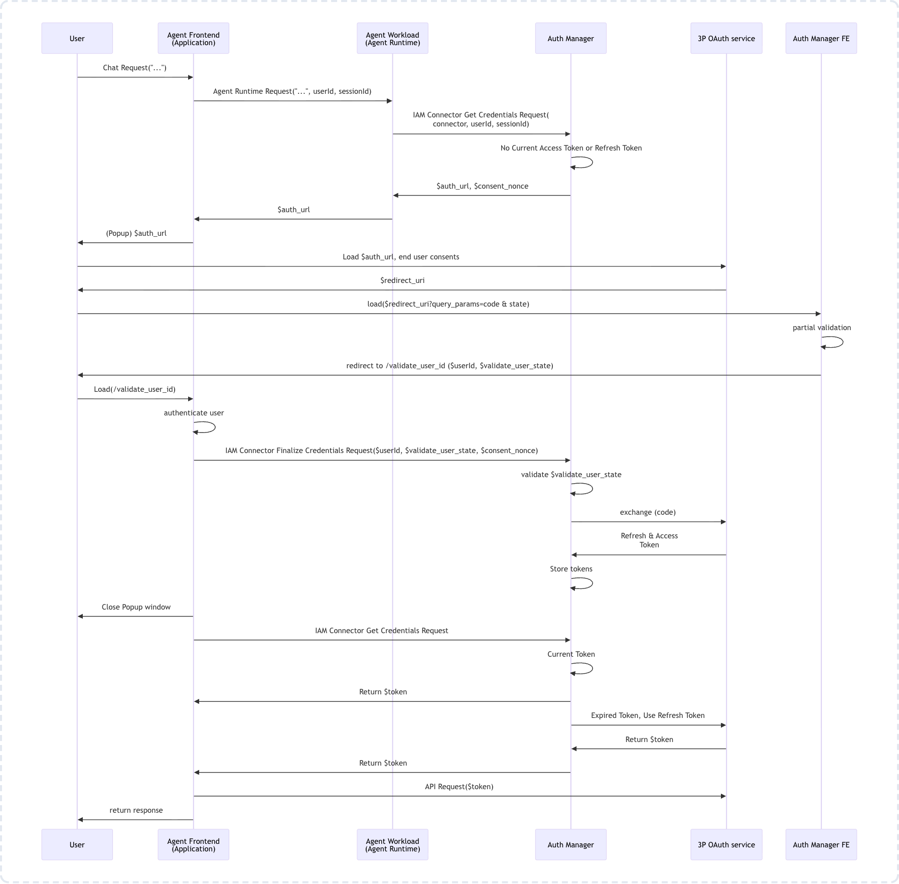

# Gemini Enterprise Agent Platform — 3-Legged OAuth (3LO) with Spotify & Auth Manager

This repository contains an end-to-end Proof of Concept (POC) demonstrating how an AI Agent deployed to the **Gemini Enterprise Agent Platform (Vertex AI Agent Engine / Reasoning Engine)** securely authenticates end users using **3-Legged OAuth (3LO)** and **Agent Identity Auth Manager**.

In this sample, the agent queries the **Spotify Web API** on behalf of the user to fetch their private playlists, using Google Cloud's managed credential vault to handle user consent, token exchange, and automatic token refresh.

---

## Architecture & OAuth 3LO Flow

The 3-legged OAuth flow delegates access to external user resources while ensuring zero token storage liability for the application. The tokens are encrypted and managed directly by Google Cloud Agent Identity Auth Manager.

### OAuth 3LO Flow Diagram



### Hop-by-Hop Flow Explanation

1. **User Request**: The user asks the agent a question requiring private data (e.g., *"Get my private playlists"*).
2. **Missing Credential Interception**: The ADK agent attempts to call `spotify_get_playlists` and queries the GCP Auth Manager. Because no valid token exists for this user, the agent pauses and yields an `adk_request_credential` tool call containing the third-party authorization URL and a `consent_nonce`.
3. **Consent Prompt**: The client application (web UI / portal) detects `adk_request_credential` and opens the Spotify authorization URL in a browser popup.
4. **User Grants Consent**: The user logs in to Spotify and clicks **Agree**.
5. **Spotify Callback to Google**: Spotify redirects the user's browser to the Google Cloud Auth Manager connector callback URL (`https://iamconnectorcredentials.googleapis.com/.../connectors/spotify-3lo-auth/oauthcallback`). Google Auth Manager securely captures the authorization code and exchanges it for user access and refresh tokens.
6. **Redirect to `continue_uri`**: Google Auth Manager redirects the browser to the application's `continue_uri` (e.g., `http://localhost:8080/commit`) with a `user_id_validation_state` token.
7. **Credentials Finalization**: The client's `/commit` endpoint calls Google's `FinalizeCredentials` API to verify the session and close the popup.
8. **Conversation Resumes**: The client sends a `FunctionResponse` to the agent. The agent seamlessly re-executes the tool call with the newly stored token and returns the private playlist data to the user.

---

## Repository Structure

```
.
├── README.md                  # Detailed architecture and setup guide
├── agent.py                   # ADK agent with Spotify 3LO authenticated tool
├── deploy.py                  # Deployment script to Vertex AI Agent Engine with AGENT_IDENTITY
├── setup_auth_manager.sh      # Shell script to provision the GCP Auth Manager connector
├── .env.example               # Template for environment variables
├── images/
│   └── oauth_3lo_flow.png     # Architectural flow diagram
└── client/                    # 3LO-compatible FastAPI web client (interactive playground)
    ├── main.py                # FastAPI backend handling chat stream and /commit callback
    ├── requirements.txt       # Client dependencies
    └── static/                # UI frontend (HTML/CSS/JS)
```

---

## Prerequisites

1. **Google Cloud Project**:
   * Project with Billing enabled (e.g., `gemini-cyber`).
   * Location: `us-central1` (or your chosen region).
   * Enabled APIs:
     * `aiplatform.googleapis.com` (Vertex AI Agent Engine)
     * `iamconnectors.googleapis.com` (IAM Connectors / Auth Manager)
   * Cloud Storage bucket for staging artifacts (e.g., `gs://agent-staging-buck`).

2. **Spotify Developer Account**:
   * An active **Spotify Premium subscription** is required by Spotify policy to access the Web API in Development Mode.
   * Access to the [Spotify Developer Dashboard](https://developer.spotify.com/dashboard).

3. **Local Environment**:
   * Python 3.10+
   * Google Cloud SDK (`gcloud`) authenticated with Application Default Credentials (`gcloud auth application-default login`).

---

## Step-by-Step Setup Guide

### Step 1: Configure Spotify Developer App

1. Go to the [Spotify Developer Dashboard](https://developer.spotify.com/dashboard) and click **Create app**.
2. App Name: `GCP-Auth-Manager-POC` (or any name).
3. Which API/SDKs are you planning to use: Select **Web API**.
4. In **Redirect URIs**, add the Google Cloud connector callback URI:
   ```text
   https://iamconnectorcredentials.googleapis.com/v1/projects/YOUR_PROJECT_ID/locations/YOUR_LOCATION/connectors/spotify-3lo-auth/oauthcallback
   ```
5. Save the app, open **Settings**, and record:
   * **Client ID**
   * **Client Secret**
6. **User Management**: In the Spotify app settings, go to **User Management** and ensure the Spotify user email accounts you will test with are on the allowlist (required for Development Mode).

---

### Step 2: Configure GCP Auth Manager Connector

Run the automated setup script or execute the `gcloud` command directly:

```bash
export GOOGLE_CLOUD_PROJECT="gemini-cyber"
export GOOGLE_CLOUD_LOCATION="us-central1"
export SPOTIFY_3LO_AUTH_PROVIDER_ID="spotify-3lo-auth"
export SPOTIFY_CLIENT_ID="<YOUR_SPOTIFY_CLIENT_ID>"
export SPOTIFY_CLIENT_SECRET="<YOUR_SPOTIFY_CLIENT_SECRET>"

./setup_auth_manager.sh
```

Or manually:
```bash
gcloud alpha agent-identity connectors create $SPOTIFY_3LO_AUTH_PROVIDER_ID \
    --project=$GOOGLE_CLOUD_PROJECT \
    --location=$GOOGLE_CLOUD_LOCATION \
    --three-legged-oauth-client-id="$SPOTIFY_CLIENT_ID" \
    --three-legged-oauth-client-secret="$SPOTIFY_CLIENT_SECRET" \
    --three-legged-oauth-authorization-url="https://accounts.spotify.com/authorize" \
    --three-legged-oauth-token-url="https://accounts.spotify.com/api/token" \
    --allowed-scopes="playlist-read-private"
```

---

### Step 3: Deploy to Gemini Enterprise Agent Platform

Run `deploy.py` to package and deploy the agent to Vertex AI Agent Engine with **Agent Identity**:

```bash
python3 deploy.py
```

The script automatically:
1. Packages `agent.py` and required dependencies (`google-adk[agent-identity]`, `google-cloud-aiplatform[agent_engines]`, `httpx`).
2. Creates the reasoning engine with `identity_type=AGENT_IDENTITY`.
3. Retrieves the deployed agent's SPIFFE Identity and binds `roles/iamconnectors.user` to the `spotify-3lo-auth` connector so the agent can retrieve tokens on behalf of authenticated users.

---

### Step 4: Run the Interactive 3LO Web Client

Standard playgrounds (like generic console test panels) do not intercept the `adk_request_credential` event or host the `/commit` endpoint. Use the included 3LO FastAPI client:

1. Navigate to the client directory and install dependencies:
   ```bash
   cd client
   pip install -r requirements.txt
   ```

2. Start the client:
   ```bash
   uvicorn main:app --port 8080 --reload
   ```

3. Open `http://localhost:8080` in your browser. *(Note: Must use `localhost`, not `127.0.0.1`)*.
4. In the settings sidebar:
   * Set **Project ID**: `gemini-cyber`
   * Set **Location**: `us-central1`
   * Click **Load Remote Agents** and select `spotify-3lo-agent`.
   * Click **Save & Apply Settings**.
5. In the chat window, send:
   > *"Get my private playlists"*
6. A popup window will prompt you to authorize with Spotify. Once approved, the popup closes, credentials are finalized with Auth Manager, and the agent outputs your private playlists.

---

## Production Enterprise Considerations

In an enterprise environment:
1. **Frontend / BFF**: The logic in `client/main.py` is embedded into the customer's existing Backend-for-Frontend (BFF) service (Cloud Run, GKE, API Gateway).
2. **Zero Token Storage Liability**: The customer's backend never touches, encrypts, or stores third-party OAuth refresh tokens. Google Auth Manager manages the entire token lifecycle.
3. **One-Time Consent UX**: Once a user completes authorization, their tokens persist in Google's managed vault under their enterprise `user_id`, meaning subsequent sessions do not require re-authentication until revoked.

---

## Disclaimer
This is a Proof of Concept (POC) sample application and is not an officially supported Google product.
