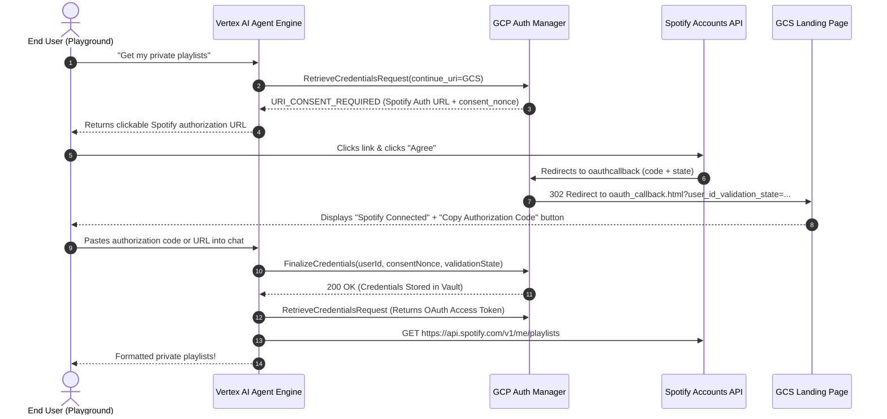

# Gemini Enterprise Agent Platform — 3-Legged OAuth (3LO) with Spotify & Auth Manager

This repository contains an end-to-end Proof of Concept (POC) demonstrating how an AI Agent deployed to the **Gemini Enterprise Agent Platform (Vertex AI Agent Engine / Reasoning Engine)** securely authenticates end users using **3-Legged OAuth (3LO)** and **Agent Identity Auth Manager**.

In this sample, the agent queries the **Spotify Web API** on behalf of the user to fetch their private playlists, using Google Cloud's managed credential vault to handle user consent, token exchange, and automatic token refresh.

---

## Supported Interaction Modes

This POC supports two primary user interaction modes:

1. **Option 2: Direct Vertex AI Agent Engine Playground (Zero-Compute Conversational Flow)**  
   * Ideal for Google Cloud Console Playground, Slack, Teams, or any headless chat interface without running custom client servers.
   * Uses a lightweight static landing page hosted on Google Cloud Storage (`oauth_callback.html`) as the `continue_uri`.
   * The agent provides a direct authorization link in chat. After approval, the landing page provides a single-click "Copy Authorization Code" button. The user pastes the code into the chat, and the agent finalizes credentials and displays the private playlists.

2. **Option 1: Custom Web App with Automated Popups (`client/`)**  
   * Ideal for enterprise web portals embedding the agent where an automatic popup/iframe authorization lifecycle is preferred.
   * Uses a FastAPI backend that handles the OAuth popup redirect and credential finalization automatically.

---

## Architecture & OAuth 3LO Flow

The 3-legged OAuth flow delegates access to external user resources while ensuring zero token storage liability for the application. The tokens are encrypted and managed directly by Google Cloud Agent Identity Auth Manager.

### OAuth 3LO Flow Diagram


### Conversational Flow (Option 2 — Playground)



---

## Repository Structure

```
.
├── README.md                  # Detailed architecture and setup guide
├── agent.py                   # ADK agent with conversational 3LO tool
├── oauth_callback.html        # Static public landing page hosted on Cloud Storage
├── deploy.py                  # Deployment script to Vertex AI Agent Engine with AGENT_IDENTITY
├── setup_auth_manager.sh      # Shell script to provision the GCP Auth Manager connector
├── .env.example               # Template for environment variables
├── images/
│   └── oauth_3lo_flow.png     # Architectural flow diagram
└── client/                    # Optional: FastAPI web client with popup handling
    ├── main.py                # FastAPI backend handling chat stream and /commit callback
    ├── requirements.txt       # Client dependencies
    └── static/                # UI frontend (HTML/CSS/JS)
```

---

## Prerequisites

1. **Google Cloud Project**:
   * Project with Billing enabled (e.g., `gemini-cyber`).
   * Location: `us-central1` (or your chosen region).
   * Enabled APIs:
     * `aiplatform.googleapis.com` (Vertex AI Agent Engine)
     * `iamconnectors.googleapis.com` (IAM Connectors / Auth Manager)
   * Cloud Storage bucket for staging artifacts and the callback landing page (e.g., `gs://agent-staging-buck`).

2. **Spotify Developer Account**:
   * An active **Spotify Premium subscription** is required by Spotify policy to access the Web API in Development Mode.
   * Access to the [Spotify Developer Dashboard](https://developer.spotify.com/dashboard).

3. **Local Environment**:
   * Python 3.10+
   * Google Cloud SDK (`gcloud`) authenticated with Application Default Credentials (`gcloud auth application-default login`).

---

## Step-by-Step Setup Guide

### Step 1: Configure Spotify Developer App

1. Go to the [Spotify Developer Dashboard](https://developer.spotify.com/dashboard) and click **Create app**.
2. App Name: `GCP-Auth-Manager-POC` (or any name).
3. Which API/SDKs are you planning to use: Select **Web API**.
4. In **Redirect URIs**, add the Google Cloud connector callback URI:
   ```text
   https://iamconnectorcredentials.googleapis.com/v1/projects/YOUR_PROJECT_ID/locations/YOUR_LOCATION/connectors/spotify-3lo-auth/oauthcallback
   ```
5. Save the app, open **Settings**, and record:
   * **Client ID**
   * **Client Secret**
6. **User Management**: In the Spotify app settings, go to **User Management** and ensure the Spotify user email accounts you will test with are on the allowlist (required for Development Mode).

---

### Step 2: Configure GCP Auth Manager Connector

Run the automated setup script or execute the `gcloud` command directly:

```bash
export GOOGLE_CLOUD_PROJECT="gemini-cyber"
export GOOGLE_CLOUD_LOCATION="us-central1"
export SPOTIFY_3LO_AUTH_PROVIDER_ID="spotify-3lo-auth"
export SPOTIFY_CLIENT_ID="<YOUR_SPOTIFY_CLIENT_ID>"
export SPOTIFY_CLIENT_SECRET="<YOUR_SPOTIFY_CLIENT_SECRET>"

./setup_auth_manager.sh
```

Or manually:
```bash
gcloud alpha agent-identity connectors create $SPOTIFY_3LO_AUTH_PROVIDER_ID \
    --project=$GOOGLE_CLOUD_PROJECT \
    --location=$GOOGLE_CLOUD_LOCATION \
    --three-legged-oauth-client-id="$SPOTIFY_CLIENT_ID" \
    --three-legged-oauth-client-secret="$SPOTIFY_CLIENT_SECRET" \
    --three-legged-oauth-authorization-url="https://accounts.spotify.com/authorize" \
    --three-legged-oauth-token-url="https://accounts.spotify.com/api/token" \
    --allowed-scopes="playlist-read-private"
```

---

### Step 3: Upload the Static Callback Landing Page

Upload `oauth_callback.html` to your public Cloud Storage staging bucket:

```bash
# Upload HTML landing page
gcloud storage cp oauth_callback.html gs://agent-staging-buck/oauth_callback.html

# Grant public read access
gcloud storage buckets add-iam-policy-binding gs://agent-staging-buck \
    --member="allUsers" \
    --role="roles/storage.objectViewer"
```

Verify it is reachable:
```bash
curl -I https://storage.googleapis.com/agent-staging-buck/oauth_callback.html
```

---

### Step 4: Deploy to Gemini Enterprise Agent Platform

Run `deploy.py` to package and deploy the agent to Vertex AI Agent Engine with **Agent Identity**:

```bash
python3 deploy.py
```

The script automatically:
1. Packages `agent.py` and required dependencies (`google-adk[agent-identity]`, `google-cloud-aiplatform[agent_engines]`, `httpx`).
2. Creates the reasoning engine with `identity_type=AGENT_IDENTITY`.
3. Retrieves the deployed agent's SPIFFE Identity and binds `roles/iamconnectors.user` to the `spotify-3lo-auth` connector so the agent can retrieve tokens on behalf of authenticated users.

---

### Step 5: Test in Vertex AI Agent Engine Playground

1. Open the [Vertex AI Agent Engine Console](https://console.cloud.google.com/vertex-ai/reasoning-engines?project=gemini-cyber).
2. Select your deployed agent: `spotify-3lo-agent`.
3. In the Playground chat, type:
   > *"Get my private playlists"*
4. The agent will reply with:
   > 🔒 **Spotify Authorization Required**  
   > 👉 [**Click here to Authorize Spotify Access**](https://accounts.spotify.com/authorize...)
5. Click the link and click **Agree** on Spotify.
6. You will be redirected to the Cloud Storage landing page showing **Spotify Connected** and your authorization code.
7. Click **📋 Copy Authorization Code** (or copy the URL).
8. Return to the Playground chat and paste the code.
9. The agent finalizes your credentials and outputs your private playlists!

---

## Production Enterprise Considerations

In an enterprise environment:
1. **Zero Token Storage Liability**: The customer's backend or agent never touches, encrypts, or stores third-party OAuth refresh tokens. Google Cloud Auth Manager manages the entire token lifecycle in an enterprise vault.
2. **One-Time Consent UX**: Once a user completes authorization, their tokens persist in Google's managed vault under their enterprise `user_id`. Subsequent queries do not require re-authentication until tokens are revoked.
3. **No Compute Infrastructure Required for Auth Callback**: By using a static HTML page in Cloud Storage (or an existing static portal asset) as the `continue_uri`, the authorization flow does not require maintaining dedicated redirect servers or microservices.

---

## Disclaimer
This is a Proof of Concept (POC) sample application and is not an officially supported Google product.
